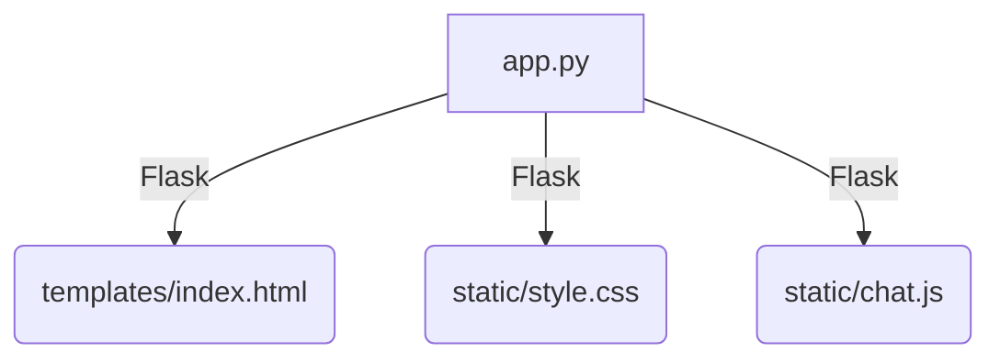

# Chatbot

## Description
This is a simple chatbot that can answer some questions about the internet provider.

## Architecture
**app.py**: This is the main file of the Flask application. It manages server routes, sets the chatbot's initial state, and responds to user interactions. Flask is used to render the HTML template and provide dynamic responses to the chatbot.\
**templates/**: This directory contains HTML files that will be rendered by Flask. Flask uses the Jinja2 templating engine to insert dynamic data into HTML files.\
**static/**: This directory stores static files such as CSS and JavaScript that are referenced in HTML to style the page and add interactivity.\
**style.css**: This CSS file defines the visual style of the page, including the appearance of the text input field, the chat box, and other layout properties.\
**chat.js**: This JavaScript file is responsible for the interactivity of the page. It handles the logic of sending the user's messages to the server and displaying the chatbot's responses in the user interface. It uses the jQuery library to simplify DOM operations and AJAX requests.\



## Running the Chatbot
1. To run the chatbot, you need to have Python installed on your computer. You can download Python from [here](https://www.python.org/downloads/).
2. Clone the repository to your local machine.
```bash
git clone https://github.com/PedroLuisDionisioFraga/C115-IoT.git
```
3. Navigate to the directory where the repository is cloned.
```bash
cd ./C115-IoT/1
```
4. Run the chatbot.
```bash
python app.py
```
5. Open your browser and go to `http://localhost:5000/` to chat with the chatbot.

Now you can chat with the chatbot and ask questions about the internet provider.
